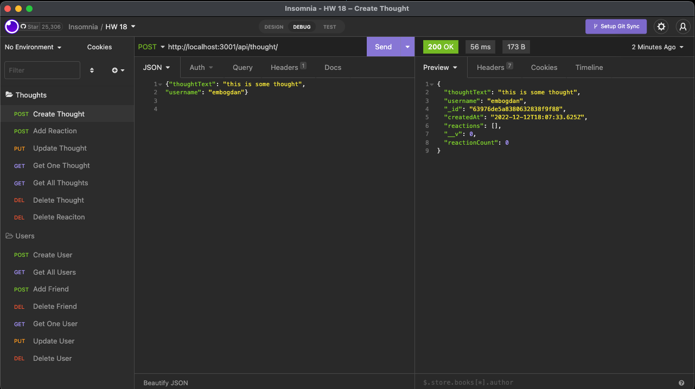

# Social-Network-API

<a href="https://drive.google.com/file/d/1pmv8KzEUI_AMV9kfCH2k27t-HZhCJeZF/view" target="_blank">Video Walkthrough</a>

## Description

Update your friends, react, and add friends with this social network using MongoDB. 

## Usage

Using insomnia update your social network! 

## Credits

Emilee Bogdan  
GitHub: emileebogdan  
Email: emileebogdan@gmail.com  